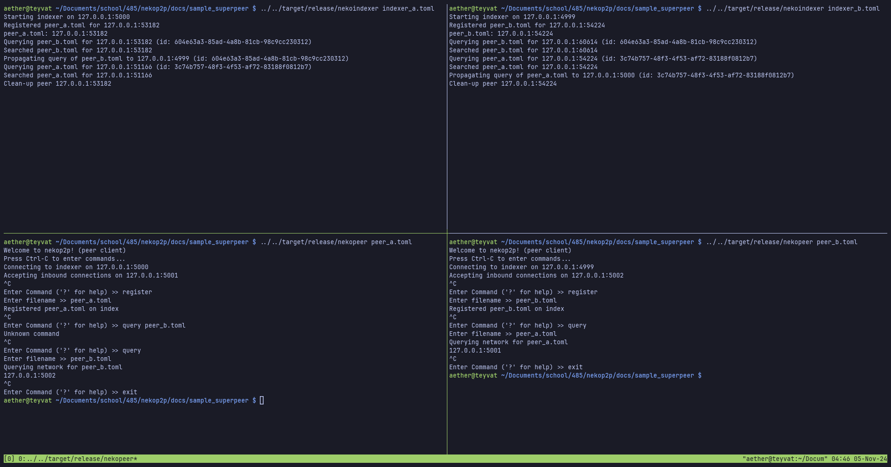

# nekop2p
A simple p2p file sharing system built on `tokio` and `tarpc`. The software
package is spit into four crates:
- `demo-profile` - `search` query profiler with plotting support
- `nekoindexer` - index server
- `nekop2p` - common library (contains RPC scheme)
- `nekopeer` - p2p client software

# Manual
## Usage
- install `rust` via [rustup](https://rustup.rs).
- (for the demo) install `tmux`
- compile with `cargo build --release`

## Superpeering
For resources on the new superpeering functionality of `nekop2p` 0.2.0, see
`docs/sample_superpeer` for sample `config.toml` files and output. Additionally,
see `docs/profile_superpeer` for raw profiling results given varying `-c`, `-i`,
and `-q`.



Additional writeups on the design and testing of the superpeering functionality
can be found under the **Superpeering** section of `docs/design.md` and
`docs/testing.md`

## Demo
To run the example demo, `cd demo/` and run `./run_demo.sh`. This will start an
instance of `nekoindexer` on `localhost:5000` and three instances of `nekopeer`
which listen on `localhost` ports `5001`, `5002`, and `5003` respectively, all
in a tmux session for easy viewing!


Sample outputs (with some variation given random download peer selection) can be
found in `docs/`.

## Profiling
```sh
$ ./target/release/demo-profile -h
A simple p2p file sharing system built on tokio and tarpc.

Usage: demo-profile [OPTIONS]

Options:
  -i, --indexers <INDEXERS>          Number of indexers to spawn [default: 1]
  -s, --start-port <START_PORT>      Number of indexers to spawn [default: 5000]
  -p, --plot                         Whether or not to plot
  -c, --concurrent <CONCURRENT>      Number of concurrent clients [default: 1]
  -n, --num-requests <NUM_REQUESTS>  Number of request rounds to run [default: 500]
  -q, --q-ttl <Q_TTL>                Query TTL [default: 0]
  -b, --b-ttl <B_TTL>                Uuid backtrace expiration [default: 10]
  -h, --help                         Print help
  -V, --version                      Print version
```

For example, to run the profiler with `10` concurrent connections and generate
plots, run `./target/release/demo-profile -c 10 --plot`. Sample outputs can be
found in `docs/`. **For accurate benchmarks, you must build with `--release`.**

## Indexer
```sh
$ ./target/release/nekoindexer -h
A simple p2p file sharing system built on tokio and tarpc.

Usage: nekoindexer <CONFIG>

Arguments:
  <CONFIG>

Options:
  -h, --help     Print help
  -V, --version  Print version
```

Config File Format
```toml
bind = "127.0.0.1:5000" # host to run on
neighbors = [ "127.0.0.1:4999" ] # neighboring indexers/superpeers
ttl = 10 # query backtrace ttl in seconds
```

To run the indexer server, run `./target/release/nekoindexer` with the above
`config.toml` file for a local server on port `5000`.

### Example Output
```sh
Starting indexer on localhost:5000
```

## Client
```sh
$ ./target/release/nekopeer -h
A simple p2p file sharing system built on tokio and tarpc.

Usage: nekopeer <CONFIG>

Arguments:
  <CONFIG>

Options:
  -h, --help     Print help
  -V, --version  Print version
```

Config File Format
```toml
indexer = "127.0.0.1:5000" # indexer to bind to
dl_bind = "127.0.0.1:5001" # incoming download address to bind to
ttl = 10 # ttl of queries in seconds
```

For example, to run a client on port `5001`, run `./target/release/nekopeer`
with the provided `config.toml` file. Subsequent client instances need a
*different* port, so specify it with the `dl_bind` key.

### Example Output
```sh
Welcome to nekop2p! (peer client)
Press Ctrl-C to enter commands...
Connecting to indexer on localhost:5000
Accepting inbound connections on localhost:5001
```

Upon pressing `Ctrl-C`, a menu interface will appear to enter commands,

```sh
Welcome to nekop2p! (peer client)
Press Ctrl-C to enter commands...
Connecting to indexer on localhost:5000
Accepting inbound connections on localhost:5001

Enter Command ('?' for help) >> ?
Available CLI commands:
register        Register file to index
download        Download file from peer on index
search          Query peers on index
deregister      Deregister file on index
query           Queries entire network for file
?               Print this help screen
exit            Quit
```

So, as an example, to download `foo.txt` from another peer (presuming another
peer *has `foo.txt` and registered it on the index server*), simply run
`download` and input `foo.txt` as the file name when prompted.

## Documentation
To view documentation, simply run `cargo doc -p [ demo-profile | nekoindexer | nekop2p | nekopeer ] --open`.

# Design and Testing
See `docs/design.md` and `docs/testing.md`. For readability, it may be advisable
to view *this README* and the associated docs on
[Github](https://github.com/lowpolyneko/nekop2p).

<!-- vim: tw=80:
-->
