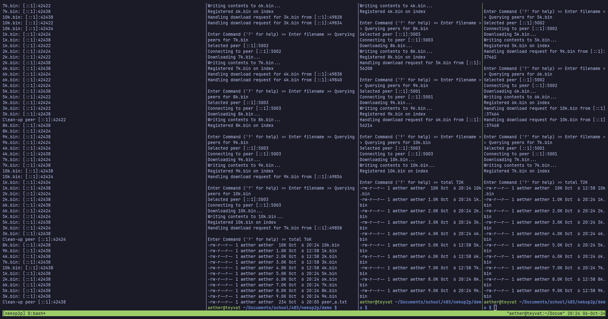

# nekop2p
A simple p2p file sharing system built on `tokio` and `tarpc`. The software
package is spit into four crates:
- `demo-profile` - `search` query profiler with plotting support
- `nekoindexer` - index server
- `nekop2p` - common library (contains RPC scheme)
- `nekopeer` - p2p client software

# Manual
## Usage
- install `rust` via [rustup](https://rustup.rs).
- (for the demo) install `tmux`
- compile with `cargo build --release`

## Demo
To run the example demo, `cd demo/` and run `./run_demo.sh`. This will start an
instance of `nekoindexer` on `localhost:5000` and tree instances of `nekopeer`
which listen on `localhost` ports `5001`, `5002`, and `5003` respectively, all
in a tmux session for easy viewing!



Sample outputs (with some variation given random download peer selection) can be
found in `docs/`.

## Profiling
```sh
$ ./target/release/demo-profile -h
Usage: demo-profile [OPTIONS] [INDEXER]

Arguments:
  [INDEXER]

Options:
  -p, --plot
  -c, --concurrent <CONCURRENT>      [default: 1]
  -n, --num-requests <NUM_REQUESTS>  [default: 500]
  -h, --help                         Print help
  -V, --version                      Print version
```

For example, to run the profiler with `10` concurrent connections and generate
plots, run `./target/release/demo-profile -c 10 --plot`. Sample outputs can be
found in `docs/`. **For accurate benchmarks, you must build with `--release`.**

## Indexer
```sh
$ ./target/release/nekoindexer -h
Usage: nekoindexer [OPTIONS] [HOST]

Arguments:
  [HOST]

Options:
  -p, --port <PORT>  [default: 5000]
  -h, --help         Print help
  -V, --version      Print version
```

To run the indexer server, run `./target/release/nekoindexer localhost` for a
local server on port `5000`.

### Example Output
```sh
Starting indexer on localhost:5000
```

## Client
```sh
$ ./target/release/nekopeer -h
Usage: nekopeer [OPTIONS] <INDEXER>

Arguments:
  <INDEXER>

Options:
      --dl-host <DL_HOST>
      --dl-port <DL_PORT>  [default: 5001]
  -h, --help               Print help
  -V, --version            Print version
```

For example, to run a client on port `5001`, run `./target/release/nekopeer
localhost:5000`. Subsequent client instances need a *different* port, so specify
it with the `--dl-port=<port>` flag. Clients bind to `localhost` by default.

### Example Output
```sh
Welcome to nekop2p! (peer client)
Press Ctrl-C to enter commands...
Connecting to indexer on localhost:5000
Accepting inbound connections on localhost:5001
```

Upon pressing `Ctrl-C`, a menu interface will appear to enter commands,

```sh
Welcome to nekop2p! (peer client)
Press Ctrl-C to enter commands...
Connecting to indexer on localhost:5000
Accepting inbound connections on localhost:5001

Enter Command ('?' for help) >> ?
Available CLI commands:
register        Register file to index
download        Download file from peer on index
search          Query peers on index
deregister      Deregister file on index
?               Print this help screen
exit            Quit
```

So, as an example, to download `foo.txt` from another peer (presuming another
peer *has `foo.txt` and registered it on the index server*), simply run
`download` and input `foo.txt` as the file name when prompted.

## Documentation
To view documentation, simply run `cargo doc -p [ demo-profile | nekoindexer | nekop2p | nekopeer ] --open`.

# Design and Testing
See `docs/design.md` and `docs/testing.md`. For readability, it may be advisable
to view *this README* and the associated docs on
[Github](https://github.com/lowpolyneko/nekop2p).

<!-- vim: tw=80:
-->
