# Testing
## Superpeering
Superpeering in `nekop2p` v0.2.0 was tested using an **all-to-all** topology
with *10* superpeers/indexers and *3* leaf-nodes/peers each. Each leaf node had
one or more files `{1..10}k.bin` and could query the entire network using its
connected superpeer/indexer with `query`.

Profiling results for superpeering is available in `docs/profile_superpeer`.

### Performance Results
Initially, a single indexer model with a `ttl=1` was tested to mimic a
Napster-style centralized distributed model for a baseline.

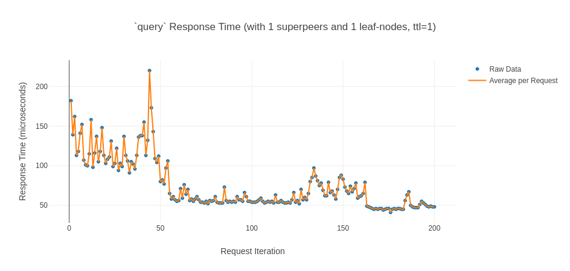
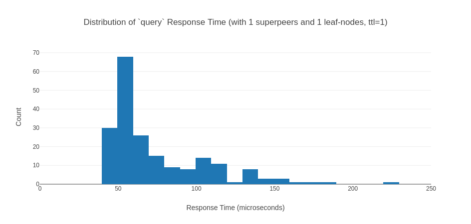

The results are nearly identical (`63.07` µs) to the results sampled in the
centralized model tested previously. The difference can likely be attributed to
the locking required on the `HashMapDelay` to track `msg_id`s with expiration.

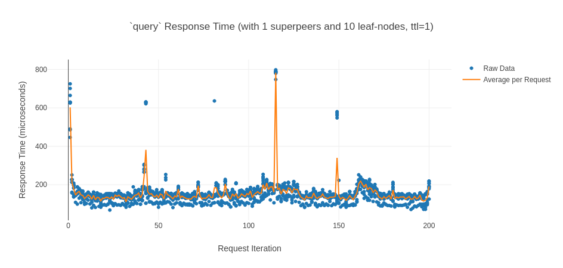
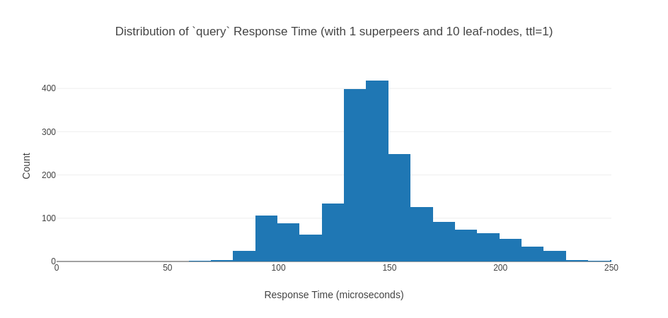

Scaling the number of clients yielded a similar increase in response time to the
initial centralized implementation (`155.02` µs), indicating a low latency cost for
introducing superpeering in the centralized case.

Now, we introduce a cluster of indexers such that they all know eachother as
neighbors. A single client sending queries is sampled.

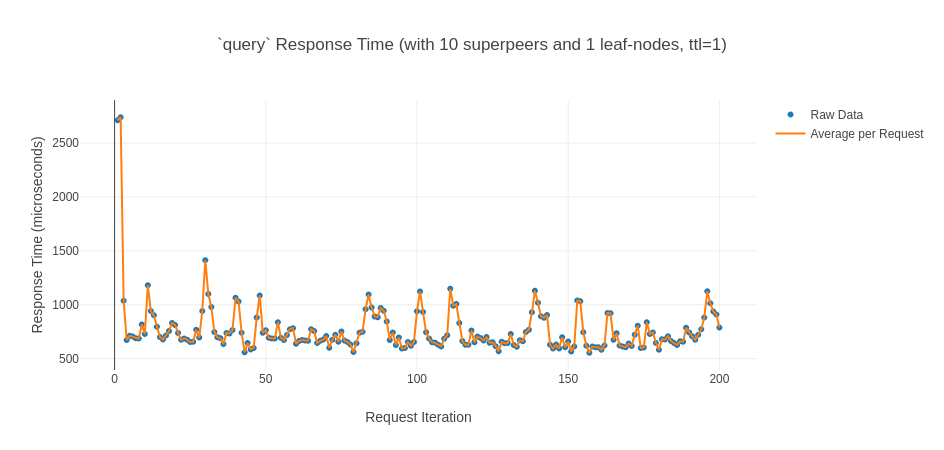

The distribution of response times remain fairly normal aswell.

Introducing the superpeering model incurs an almost 10x penalty to latency
(average of `788.83` µs), which makes since given the required propogation of
the `query` to **every** neighboring superpeer and the wait requirement for
back-propagation.

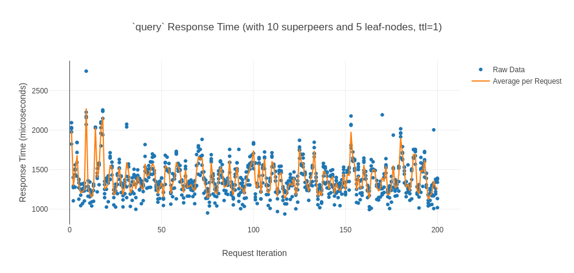

The distribution of response times continues to remain fairly normal.

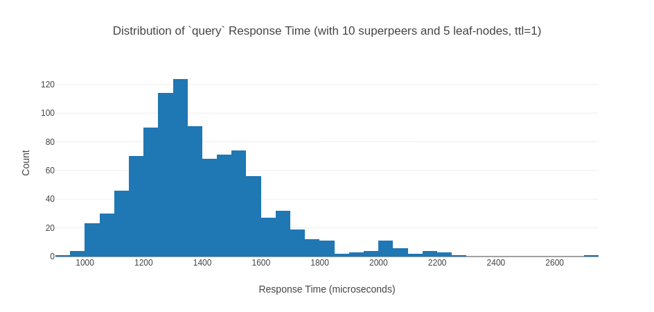

With a concurrent load, the average jumps to `1.44` ms over `localhost`. This
means we see only a doubling of response time with additional clients. This
follows the doubling of response time experience in the centralized model,
meaning that the superpeering model scales similarly, albeit with a higher cost
due to the propagation requirement.

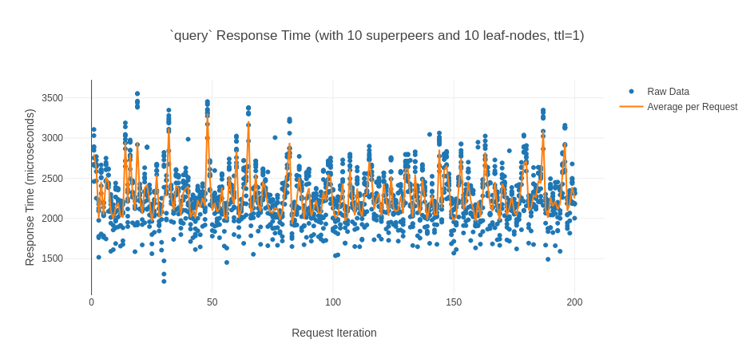
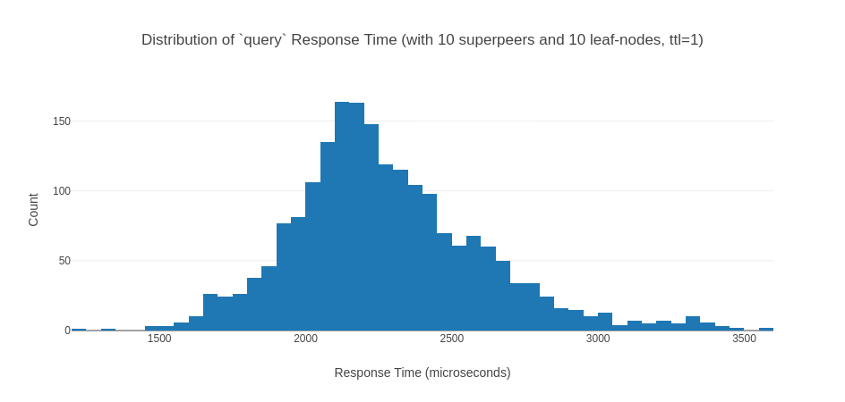

Similar doubling with `-c 10` clients (average `2.28` ms) and a maintained
normal distribution.

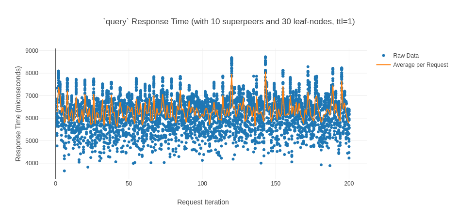
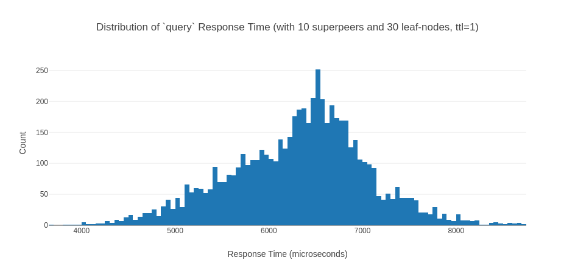

And a tripling with `-c 30` clients (average `6.32` ms) with a normal
distribution.

However, where scaling of this model suffers is in an increase of `ttl`, or the
number of propogations.

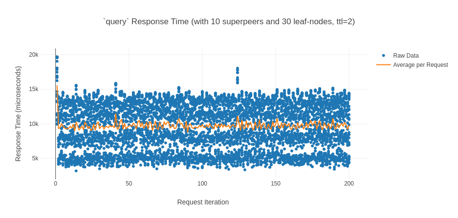

Setting a `ttl` of $2$ increases the reponse time by nearly `3` ms alone.
However, this increase is exponential, as `ttl=3` increases response time to a
point where `nekop2p` will not profile due to the 10 second query timeout limit
of `tarpc`.

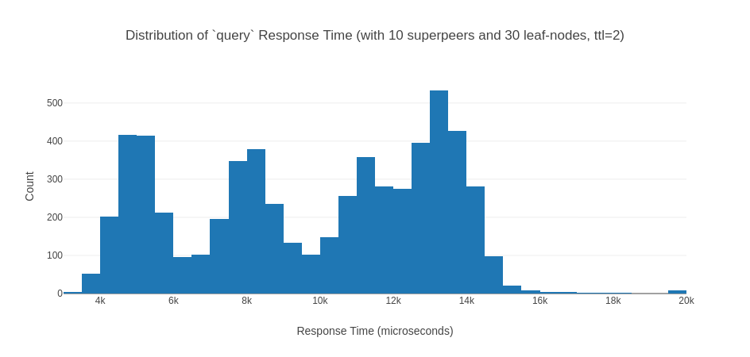

Additionally, the distribution time of response becomes extremely volatile, this
is likely attributed to the inconsistency of propgation times past the initial
superpeer hop.

## Tests Done
Here is a non-exhaustive list of tests done and the revealed problem:
- In the initial version of `nekoindexer`, peers would not be able to connect
  after a single peer joined. This was due to the listener being `await`ed only
  for the first client connection. However, after this connection was dropped,
  the subsequent connections were not `await`ed and thus the program gracefully
  exited. This was solved by `await`ing all new `accept`s.
- In initial implementations, the underlying `HashMap` was stored in the
  `IndexerServer` struct, on new client connections, the `IndexerServer` struct
  would have a new copy created *per-connection*, meaning that files registered
  by a peer would only be seen in the context of that peer's corrisponding
  `IndexerServer` struct on the server. In practice, this means peers couldn't
  see eachother's registered files. This was solved by sharing the data
  structure **between peer connections** using an `Arc<T>`.
- `self.index` in `IndexerServer` initially used `String`s as the key and value,
  and this caused issues when multiple peers with the same IP address attempted
  to write to the index. This was solved by keying the filename to a
  `HashSet<SocketAddr>` instead which represented the peer's remote IP and port,
  and storing the corrisponding incoming port for the peer in a separate
  `HashMap<SocketAddr, u16>` instead.
- Upon query of a file using `search`, the response would have a vector with
  duplicate peer entires. This was due to a typo in the `deregister` function in
  `IndexerServer` where I looked up the incoming port `HashMap` with the wrong
  key.
- Early versions of `nekopeer` had little to no error-handling, meaning that
  simple problems such as a socket failing to bind or a failed file download
  would crash the entire program. This has been solved by removing all `?` and
  `.unwrap()`s from the `nekopeer` client code and allowing the Rust compiler to
  enforce error handling.

## Performance Results
The utilization of an async model with a pre-allocated thread pool turns out to
be quite effective for this use-case. Below is a baseline benchmark running 500
search requests sequentially.

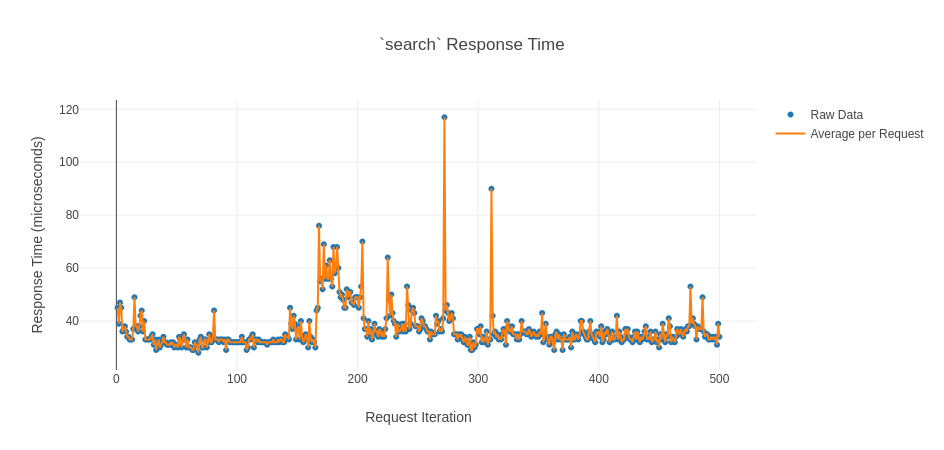

Overall queries average a response time of `37.28` µs over `localhost` which is
quite impressive. This is around the range of plain TCP RTT on `localhost`[^1].
This means that the overhead of Tarpc and Tokio is negligible when considering
sequential connections.

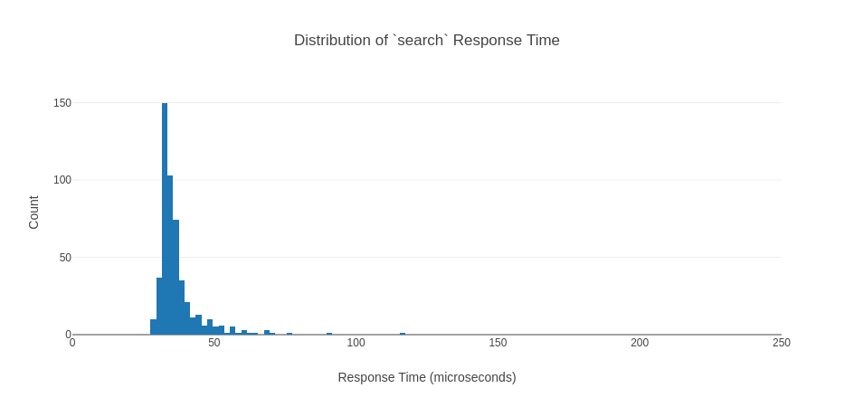

We can see the distribution of response times follows a normal distribution
aswell.

## 5 Concurrent
With a concurrent load, the average jumps to `90.58` µs over `localhost`. This
means we see only a doubling of response time in the *microsecond* range with
additional clients.

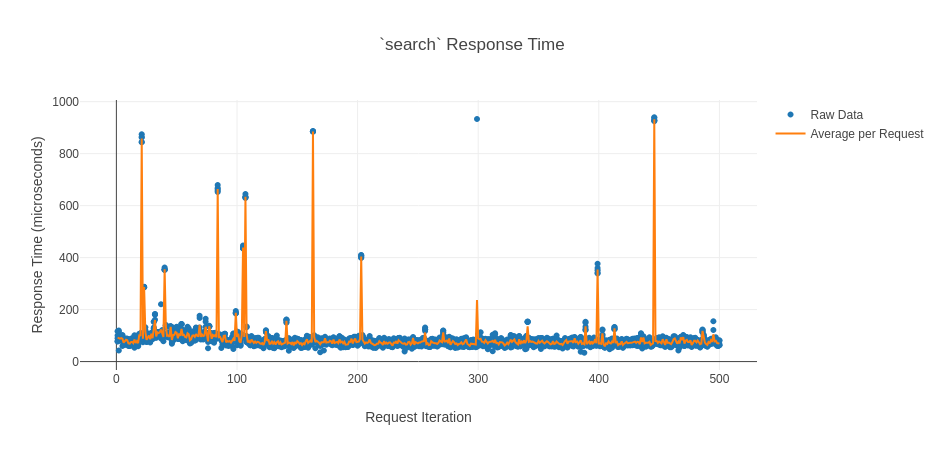

The distribution of response times remain fairly normal aswell.

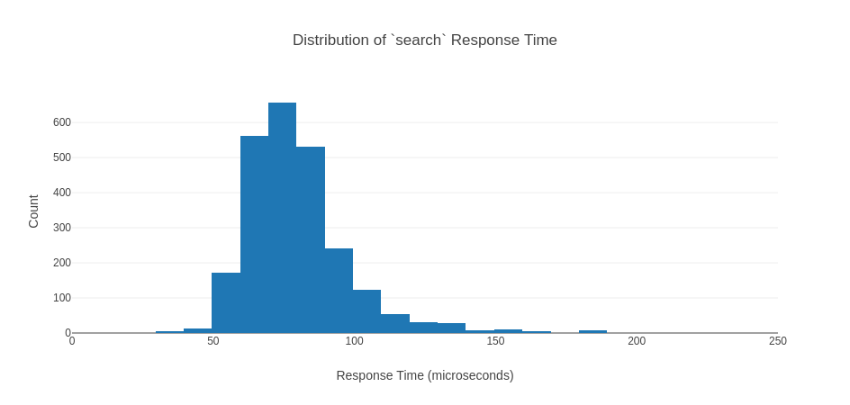

## 10 Concurrent
With a doubled concurrent load, the average jumps to `123.51` µs over
`localhost`. While I do not have further data to analyze, this indicates that
response time with the async model of `nekop2p` scales logarithmically.

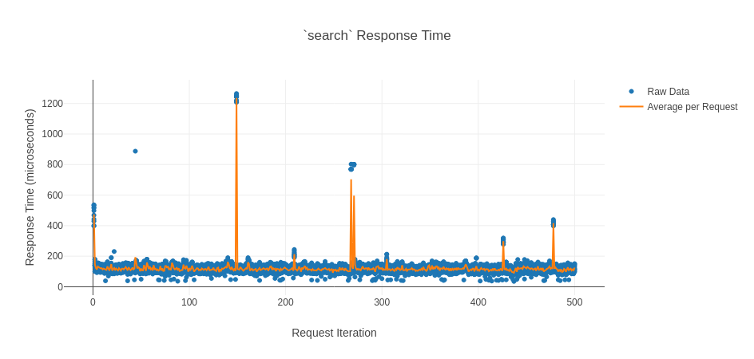

The distribution of response times continues to remain fairly normal.

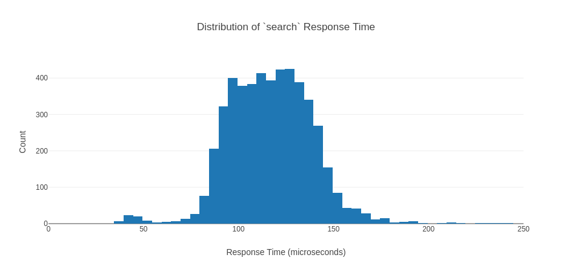

## Note on Response Time Spike with Beginning Requests
In the concurrent examples, initial responses incur a significantly higher cost
than subsequent runs. I attribute this to the locking scheme used by the
underlying `HashMap` (the `dashmap` crate). Dashmap's implementation allows for
better concurrency than simply wrapping a `HashMap<K,V>` around a `Mutex<T>`,
and I believe that response time amortizes as requests increase in-spite of
lock contention between threads with multiple clients querying.

[^1]: http://doc-ok.org/?p=1985

<!-- set vim: tw=80:
-->
